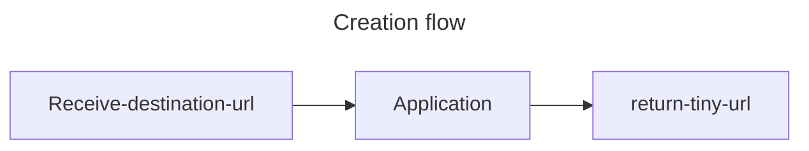
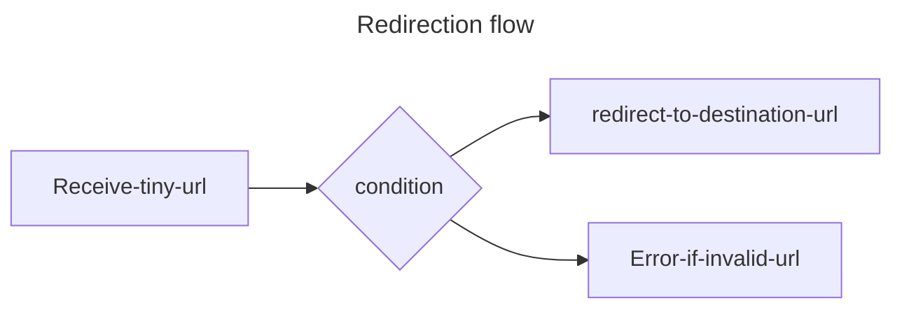

# URL Shortner 

This application generates short URL for the provided URL in request.

   
- The destination url is saved in DB along with the returned tiny URL

- Received tiny URL is used to fetch the destination URL via the `hash-str` present in the tiny-url. 